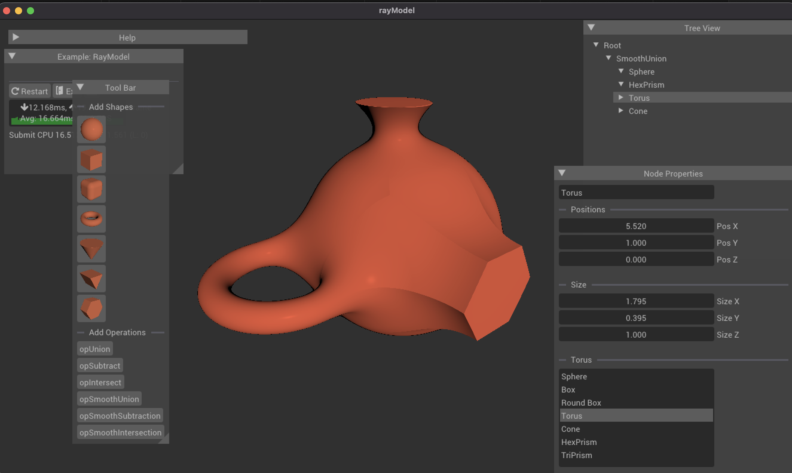

# RayModel

3D editor for modeling with SDFs.

## Note!

This project is currently unfinished and not intended for serious use. I plan on reworking and improving this editor using Rust 🦀 and WebGPU in the future. If you're in need of a stable SDF editor, I recommend using Clavicula (http://clavicula.link) or Womp (https://womp.com).

## Getting Started

### Installing

```  
git clone --recurse-submodules https://github.com/xerxest/Ray-Marching-3D-Modeler.git
```

### Executing program

 cd into cloned repo.

```
mkdir build  
cd build/
cmake .. 
./rayModel
```

